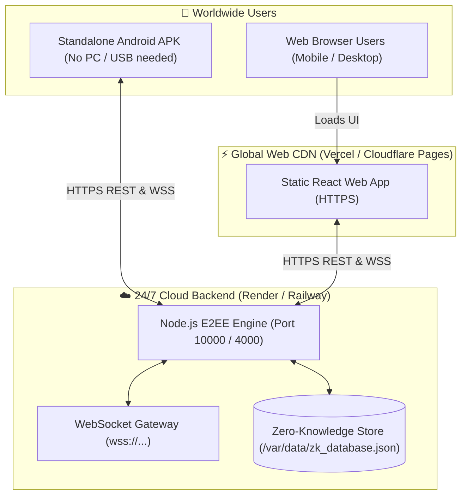

# 🚀 CipherSocial Production Deployment Guide

This guide walks you through deploying **CipherSocial** to 24/7 cloud infrastructure with **Zero PC dependency** and generating a **Standalone Android APK** for any device worldwide.

---

## 🏗️ Production Architecture Overview



> [!NOTE]
> **Zero-Knowledge Guarantee:**
> Because all encryption (AES-256-GCM + Double Ratchet) happens exclusively inside the client device, hosting the backend on public cloud providers (Render, Railway, AWS, DigitalOcean) is completely safe. The cloud host only ever stores and relays encrypted ciphertext blobs.

---

## ☁️ Part 1: Deploy Backend Engine to Render.com (100% Free 24/7)

**[Render.com](https://render.com)** provides free hosting with automatic HTTPS and WebSocket support.

### Step 1: Push Code to GitHub
Make sure your project is pushed to a GitHub repository:
```bash
git add .
git commit -m "Configure production cloud deployment"
git push origin main
```

### Step 2: Create Web Service on Render
1. Log in to [Render.com](https://dashboard.render.com/).
2. Click **New +** → **Web Service**.
3. Connect your GitHub repository.
4. Fill in the settings:
   - **Name**: `ciphersocial-engine` (or your chosen name)
   - **Root Directory**: `server`
   - **Environment**: `Node`
   - **Build Command**: `npm install`
   - **Start Command**: `node index.js`
   - **Plan Type**: `Free`
5. Click **Advanced** → **Add Environment Variable**:
   - `NODE_ENV`: `production`
   - `PORT`: `10000`
   - `DATA_DIR`: `./data` *(or add a 1GB Persistent Disk mounted at `/var/data`)*
6. Click **Create Web Service**.

Render will deploy your backend in ~60 seconds and give you a live URL, for example:
👉 `https://ciphersocial-engine.onrender.com`
*(WebSockets are automatically available at `wss://ciphersocial-engine.onrender.com`)*

---

## ⚡ Part 2: Deploy Web Client to Vercel (Free Global CDN)

**[Vercel](https://vercel.com)** serves the React web interface over a fast global edge network.

### Step 1: Import Project to Vercel
1. Log in to [Vercel](https://vercel.com).
2. Click **Add New...** → **Project** → Select your GitHub repository.
3. In the setup screen:
   - **Framework Preset**: `Vite`
   - **Root Directory**: Click **Edit** and select `user-client` (or `client` for Admin).
   - **Build Command**: `npm run build`
   - **Output Directory**: `dist`
4. Expand **Environment Variables** and add:
   - **Name**: `VITE_ENGINE_URL`
   - **Value**: `https://ciphersocial-engine.onrender.com` *(Your Render backend URL from Part 1)*
5. Click **Deploy**.

Your web app will be live globally at:
👉 `https://your-project.vercel.app`

---

## 📱 Part 3: Build Standalone Android APK for Any Phone

With the backend running on the cloud, your Android app no longer needs USB cables, local Wi-Fi, or ADB port forwarding.

### Step 1: Update the Default Cloud URL in App
In [`user-client/src/utils/engineConfig.js`](file:///c:/Users/PC/.gemini/antigravity/scratch/e2ee-social-app/user-client/src/utils/engineConfig.js):
```javascript
export const DEFAULT_PRODUCTION_CLOUD_URL = 'https://ciphersocial-engine.onrender.com';
```
*(Or users can simply tap **Engine Settings** → **☁️ Production Cloud** in the app UI)*

### Step 2: Build the APK
In your terminal, navigate to `user-client`:
```bash
cd user-client
npm run build:apk:release
```
*(Or `npm run build:apk` for a debug build)*

### Step 3: Locate Your APK
The compiled APK will be generated at:
```
user-client/android/app/build/outputs/apk/release/app-release.apk
```
*(Or `user-client/android/app/build/outputs/apk/debug/app-debug.apk`)*

### Step 4: Distribute to Users
- **Direct Download**: Upload `app-release.apk` to Google Drive, Telegram, or your Vercel website for direct 1-click download.
- **Google Play Store**: You can submit this same build to the Google Play Developer Console as an App Bundle (`./gradlew bundleRelease`).

---

## 🐳 Part 4: Docker & Custom VPS Deployment (Alternative)

If you have a Linux VPS (Ubuntu on DigitalOcean, Hetzner, AWS EC2, Linode):

```bash
# Clone repository
git clone https://github.com/your-username/e2ee-social-app.git
cd e2ee-social-app/server

# Build Docker image
docker build -t ciphersocial-engine .

# Run container with persistent volume mount
docker run -d \
  --name ciphersocial \
  -p 4000:4000 \
  -v /var/ciphersocial/data:/app/data \
  --restart always \
  ciphersocial-engine
```

Configure Nginx as a reverse proxy with Let's Encrypt for custom domains (`api.yourdomain.com`).

---

## ✅ Production Readiness Checklist

- [x] Multi-stage `Dockerfile` with healthcheck
- [x] Render.com Blueprint (`render.yaml`) with volume mount support
- [x] Configurable dynamic storage path (`process.env.DATA_DIR`)
- [x] `/health` endpoints for cloud uptime monitoring
- [x] Single-command standalone Android APK build script (`npm run build:apk:release`)
- [x] Vercel SPA routing rewrites (`vercel.json`)
- [x] One-tap Cloud Endpoint switcher in app settings
